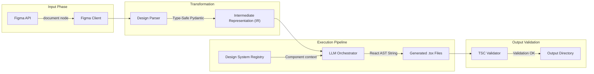

<div align="center">
  <h1>Dezain</h1>
  <p><strong>Figma to React + TypeScript + TailwindCSS Generation Pipeline</strong></p>

  [](https://www.python.org/downloads/)
  [](https://github.com/faycalraghibi/Dezain/actions)
  [](#development--testing)
  [](https://opensource.org/licenses/MIT)
</div>


Dezain is a TDD-driven pipeline that maps Figma designs into functional React components using LangChain, OpenAI, and Ollama. It enforces strict type-safety, robust testing, and automated AST validation.

## Key Features

- **Figma Integration**: Authenticates with Figma API to extract layout geometry, frames, and vector hierarchies.
- **LLM Code Generation**: Authors React & TypeScript UI components dynamically. Supports OpenAI (cloud) or Ollama (local).
- **Design System Awareness**: Maps extracted tokens to your local component library and automatically converts them to TailwindCSS classes.
- **Automated Validation**: Scaffolds ASTs and compiles against `tsc` prior to output to ensure syntax validity.
- **Live Preview Server**: Instantiates a Vite dev server to render generated components locally post-generation.
- **Multi-Frame Processing**: Accepts targeted `--frame` ID arrays for deep, modular component extraction.

## Architecture




## Quick Start

### Installation

```bash
git clone https://github.com/Faycalraghibi/Dezain.git
cd Dezain

python -m venv desain-venv
source desain-venv/bin/activate    # Linux/MacOS
# desain-venv\Scripts\activate     # Windows

pip install -e ".[dev]"
```

### Configuration
```bash
dezain init
# Edit dezain.config.yaml to define custom mappings
```

### Usage

**Demo Mode (No Figma token required):**
```bash
dezain generate --sample --preview
```

**Generation via Figma URL:**
```bash
cp .env.example .env
# Set FIGMA_TOKEN and OPENAI_API_KEY
dezain generate --file-url "https://figma.com/file/XXXXX/Design"
```

**Targeted Frame Extraction:**
```bash
dezain generate --file-url "..." --frame "1:2" --frame "3:4"
```

## Docker Support

Run isolated generation or self-hosted LLM workflows:
```bash
# OpenAI inference
docker compose up dezain

# Ollama local inference
docker compose --profile local-llm up
```


## Development & Testing

```bash
# Run test suite (requires 92%+ coverage)
pytest tests/ --cov=dezain

# Check format and linting
ruff check dezain/ tests/
ruff format --check dezain/ tests/

# Static type check
mypy dezain/ tests/
```

> **Note:** Install git-hooks via `pre-commit install` to automatically validate pushes.


## License
MIT License
